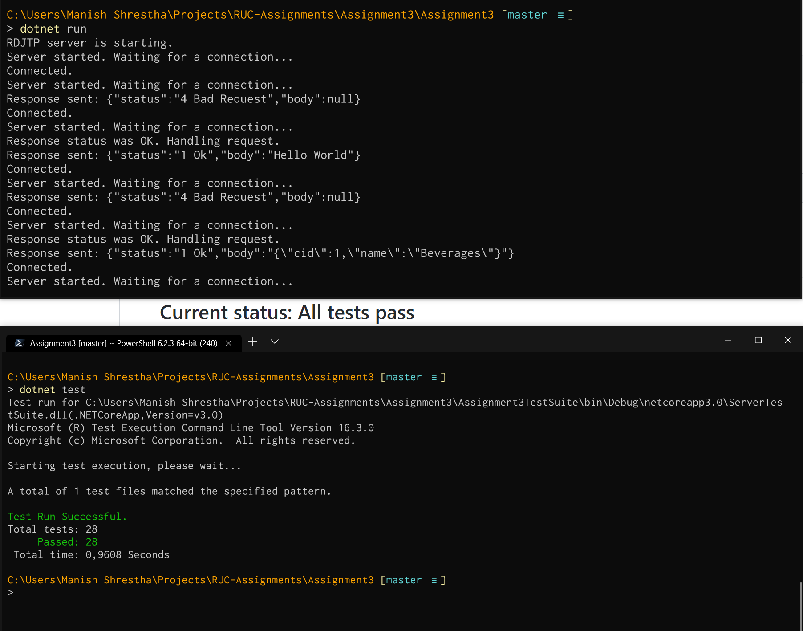
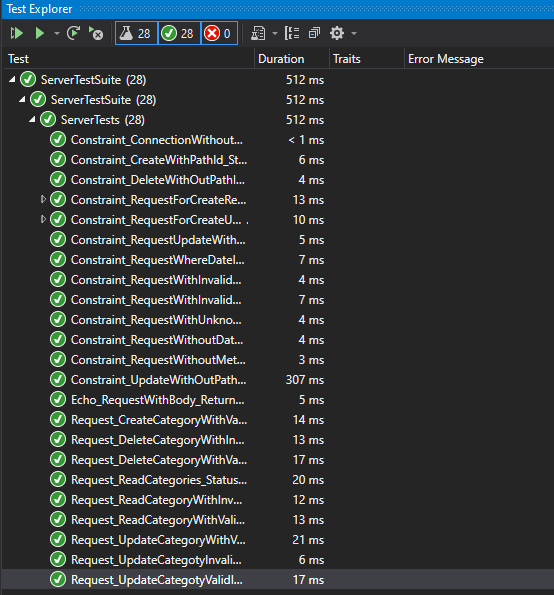
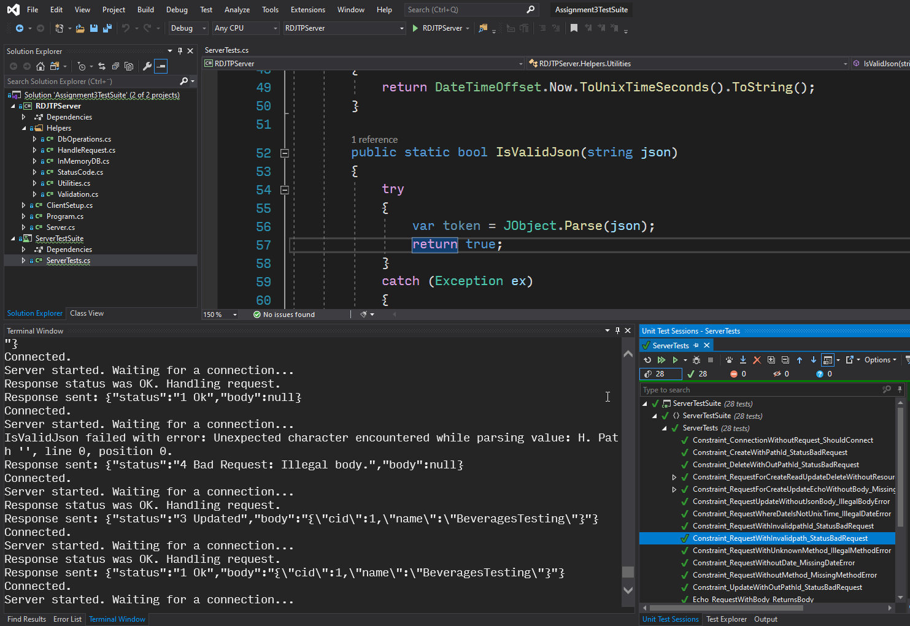

# 

## RAWDATA Assignment 3 – Network

This assignment concerns development of a network service using the RDJTP – RawData JSON Transport Protocol.
The task is to create a network service that provide the functionality defined by the RDJTP using Test Driven Development (TDD).

[Assignment description](https://github.com/shrestaz/RUC-RAWDATA/blob/master/dotnet/Assignment3/Assignment%20Description.pdf)

[Assignment hand-in document](https://github.com/shrestaz/RUC-RAWDATA/blob/master/dotnet/Assignment3/RAW4%20Assignment%203.pdf)

This network service was developed by group **raw4** of course RAWDATA (Master's in Computer Science, Roskilde University):
- [Özge Yaşayan](https://github.com/ozgey99)
- [Shushma Devi Gurung](https://github.com/shus0001)
- [Ivan Spajić](https://github.com/ivanspajic)
- [Manish Shrestha](https://github.com/shrestaz)

## Current status: All tests pass (28 out of 28)

### Screenshots of test output:

1. Terminal:

2. Test Explorer:

3. Visual Studio:

Happy Coding! 👨‍💻 👩‍💻

