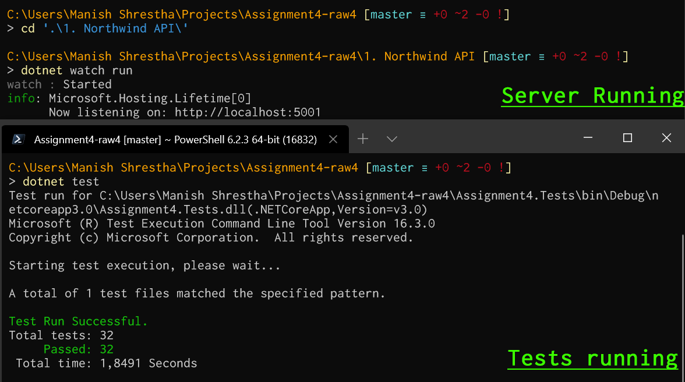
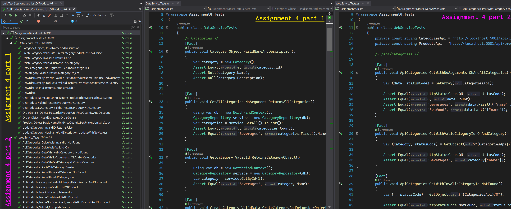

# 


## RAWDATA Assignment 4 – Web Service and Data Layer

This assignment is in two parts.

The first part is about creating a domain model and as data service. The data service is the layer that communicates with the database and provide an interface to the rest of the  system. The data service also takes care of the transformation between the database model and the domain model.

In the second part, a restful webservice is added in a layer on top of the data layer from the first part. 

[Assignment description](Resources/RAWDATA-2019-Assignment4.pdf)

This assignment was developed by group **raw4** of course RAWDATA (Master's in Computer Science, Roskilde University):
- [Özge Yaşayan](https://github.com/ozgey99)
- [Shushma Devi Gurung](https://github.com/shus0001)
- [Ivan Spajić](https://github.com/ivanspajic)
- [Manish Shrestha](https://github.com/shrestaz)

----

## Current status:
 Part 1: Complete. 18 out of 18 tests pass.

 Part 2: Complete. 14 out of 14 tests pass.


## Results:

1. Terminal:



2. Visual Studio test explorer:



----

## Steps to reproduce:

> **Prerequisites: You must have [Git](https://git-scm.com/downloads) and [.Net Core 3.0 SDK](https://dotnet.microsoft.com/download) installed. Use OS and IDE of your choice. Additionally, you must have [PostgreSQL](https://www.postgresql.org/download/) installed with the database set up.**

0. Open a terminal and clone the project: `git clone https://github.com/shus0001/Assignment4-raw4.git`

1. Navigate into the project: `cd Assignment4-raw4`

_If you have the database setup already, skip to step 4._

> _These steps assumes you are using Windows, "postgres" is the user as setup by default when installing PostgreSQL and you have set the "Environment Variables" correctly._

2. From the same terminal, create a database:
```
psql -U postgres -c "create database northwind"
``` 

3. Using the provided `.sql` file, seed the database:
```
psql -U postgres -d northwind -f .\Resources\northwind_postgres.sql
```

Now, the database has been created and seeded. Use the software of your choice to connect and visualise the database, or use the included pgAdmin. For more information on the data, [read here.](Resources/RAWDATA-2019-Assignment4.pdf)

4. **Important:** Update with the password of your postgres user in `3.Data Layer\Database Context\NorthwindContext.cs`: Line 12 on the variable `string connectionString`.
> _You can also update the name of the database and the user if you had your database set up differently._

----

### Running the tests

#### Visual Studio:
5. Open Project or Solution > navigate to the cloned folder and open solution named `Northwind.sln`.

6. Start the server.

    - From terminal:

            1. Navigate to "1. Northwind API" folder. 
                cd '.\1. Northwind API\'
            2. Run the project. 
                dotnet watch run

    - From Visual Studio GUI:

            1. "Debug" menu > "Start without Debugging" or `Ctrl` + `F5`

7. Run the test.

    - From terminal:

            1. Navigate to projects root folder. 
                cd ..
            2. Run the project. 
                dotnet test

    - From Visual Studio GUI:

            1. Go to "Test" menu > "Run All Tests"

Happy Coding! 👨‍💻 👩‍💻
